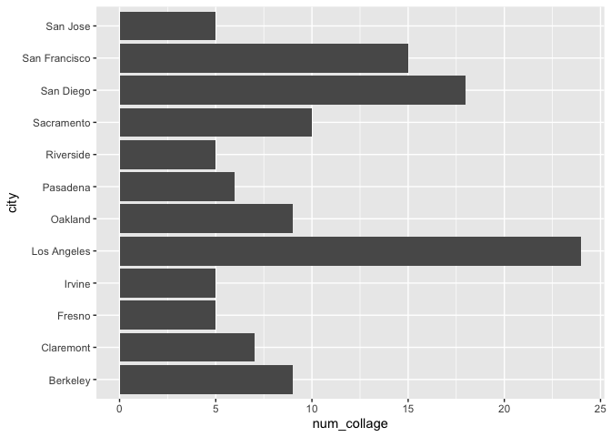
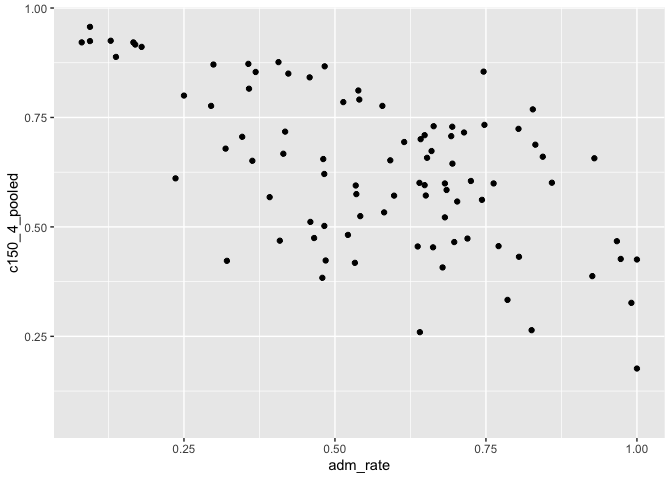

## Instructions
Answer the following questions and complete the exercises in RMarkdown. Please embed all of your code and push your final work to your repository. Your final lab report should be organized, clean, and run free from errors. Remember, you must remove the `#` for the included code chunks to run. Be sure to add your name to the author header above.  

Make sure to use the formatting conventions of RMarkdown to make your report neat and clean!  

## Load the libraries

```r
library(tidyverse)
library(janitor)
library(here)
library(naniar)
```

For this homework, we will take a departure from biological data and use data about California colleges. These data are a subset of the national college scorecard (https://collegescorecard.ed.gov/data/). Load the `ca_college_data.csv` as a new object called `colleges`.

```r
colleges<- read.csv("~/Desktop/BIS15W2024_tlin/lab10/data/ca_college_data.csv")
```

The variables are a bit hard to decipher, here is a key:  

INSTNM: Institution name  
CITY: California city  
STABBR: Location state  
ZIP: Zip code  
ADM_RATE: Admission rate  
SAT_AVG: SAT average score  
PCIP26: Percentage of degrees awarded in Biological And Biomedical Sciences  
COSTT4_A: Annual cost of attendance  
C150_4_POOLED: 4-year completion rate  
PFTFTUG1_EF: Percentage of undergraduate students who are first-time, full-time degree/certificate-seeking undergraduate students  

1. Use your preferred function(s) to have a look at the data and get an idea of its structure. Make sure you summarize NA's and determine whether or not the data are tidy. You may also consider dealing with any naming issues.

```r
colleges<-clean_names(colleges)
str(colleges)
```

```
## 'data.frame':	341 obs. of  10 variables:
##  $ instnm       : chr  "Grossmont College" "College of the Sequoias" "College of San Mateo" "Ventura College" ...
##  $ city         : chr  "El Cajon" "Visalia" "San Mateo" "Ventura" ...
##  $ stabbr       : chr  "CA" "CA" "CA" "CA" ...
##  $ zip          : chr  "92020-1799" "93277-2214" "94402-3784" "93003-3872" ...
##  $ adm_rate     : num  NA NA NA NA NA NA NA NA NA NA ...
##  $ sat_avg      : int  NA NA NA NA NA NA NA NA NA NA ...
##  $ pcip26       : num  0.0016 0.0066 0.0038 0.0035 0.0085 0.0151 0 0.002 0.0021 0.0324 ...
##  $ costt4_a     : int  7956 8109 8278 8407 8516 8577 8580 9181 9281 9370 ...
##  $ c150_4_pooled: num  NA NA NA NA NA ...
##  $ pftftug1_ef  : num  0.355 0.541 0.357 0.382 0.275 ...
```

```r
glimpse(colleges)
```

```
## Rows: 341
## Columns: 10
## $ instnm        <chr> "Grossmont College", "College of the Sequoias", "College…
## $ city          <chr> "El Cajon", "Visalia", "San Mateo", "Ventura", "Oxnard",…
## $ stabbr        <chr> "CA", "CA", "CA", "CA", "CA", "CA", "CA", "CA", "CA", "C…
## $ zip           <chr> "92020-1799", "93277-2214", "94402-3784", "93003-3872", …
## $ adm_rate      <dbl> NA, NA, NA, NA, NA, NA, NA, NA, NA, NA, NA, NA, NA, NA, …
## $ sat_avg       <int> NA, NA, NA, NA, NA, NA, NA, NA, NA, NA, NA, NA, NA, NA, …
## $ pcip26        <dbl> 0.0016, 0.0066, 0.0038, 0.0035, 0.0085, 0.0151, 0.0000, …
## $ costt4_a      <int> 7956, 8109, 8278, 8407, 8516, 8577, 8580, 9181, 9281, 93…
## $ c150_4_pooled <dbl> NA, NA, NA, NA, NA, NA, 0.2334, NA, NA, NA, NA, 0.1704, …
## $ pftftug1_ef   <dbl> 0.3546, 0.5413, 0.3567, 0.3824, 0.2753, 0.4286, 0.2307, …
```

```r
anyNA(colleges)
```

```
## [1] TRUE
```

2. Which cities in California have the highest number of colleges?

```r
colleges%>%
  count(city)%>%
  arrange(desc(n))
```

```
##                    city  n
## 1           Los Angeles 24
## 2             San Diego 18
## 3         San Francisco 15
## 4            Sacramento 10
## 5              Berkeley  9
## 6               Oakland  9
## 7             Claremont  7
## 8              Pasadena  6
## 9                Fresno  5
## 10               Irvine  5
## 11            Riverside  5
## 12             San Jose  5
## 13              Anaheim  4
## 14             El Cajon  4
## 15            Fullerton  4
## 16              Redding  4
## 17        Santa Barbara  4
## 18         Santa Monica  4
## 19             Stockton  4
## 20              Alameda  3
## 21          Bakersfield  3
## 22              Hayward  3
## 23              Modesto  3
## 24            Oceanside  3
## 25               Orange  3
## 26               Pomona  3
## 27              Salinas  3
## 28       San Bernardino  3
## 29          Santa Clara  3
## 30           Santa Rosa  3
## 31              Ventura  3
## 32              Visalia  3
## 33             Whittier  3
## 34             Carlsbad  2
## 35               Clovis  2
## 36           Costa Mesa  2
## 37               Eureka  2
## 38         Garden Grove  2
## 39             Glendale  2
## 40            Hollywood  2
## 41     Huntington Beach  2
## 42             La Jolla  2
## 43            Lancaster  2
## 44           Long Beach  2
## 45               Merced  2
## 46             Monterey  2
## 47               Oxnard  2
## 48          Palm Desert  2
## 49            Palo Alto  2
## 50        Pleasant Hill  2
## 51              Rocklin  2
## 52      San Luis Obispo  2
## 53            Santa Ana  2
## 54        Santa Clarita  2
## 55           Santa Cruz  2
## 56          Santa Maria  2
## 57             Van Nuys  2
## 58          West Covina  2
## 59               Angwin  1
## 60                Aptos  1
## 61               Arcata  1
## 62             Atherton  1
## 63                Azusa  1
## 64              Barstow  1
## 65              Belmont  1
## 66            Blue Lake  1
## 67               Blythe  1
## 68              Burbank  1
## 69          Carpinteria  1
## 70               Carson  1
## 71           Chatsworth  1
## 72                Chico  1
## 73          Chula Vista  1
## 74       Citrus Heights  1
## 75             Coalinga  1
## 76               Colton  1
## 77              Compton  1
## 78               Corona  1
## 79          Culver City  1
## 80            Cupertino  1
## 81              Cypress  1
## 82            Daly City  1
## 83                Davis  1
## 84            El Centro  1
## 85             El Monte  1
## 86           Emeryville  1
## 87            Escondido  1
## 88            Fairfield  1
## 89      Fountain Valley  1
## 90              Fremont  1
## 91               Gilroy  1
## 92             Glendora  1
## 93        Granada Hills  1
## 94      Huntington Park  1
## 95             Imperial  1
## 96            Kentfield  1
## 97              La Mesa  1
## 98            La Mirada  1
## 99             La Verne  1
## 100        Laguna Beach  1
## 101          Loma Linda  1
## 102     Los Altos Hills  1
## 103              Malibu  1
## 104          Marysville  1
## 105         Minneapolis  1
## 106       Mission Viejo  1
## 107       Monterey Park  1
## 108            Moorpark  1
## 109              Moraga  1
## 110                Napa  1
## 111       National City  1
## 112       Newport Beach  1
## 113     North Hollywood  1
## 114          Northridge  1
## 115             Norwalk  1
## 116            Oroville  1
## 117           Pittsburg  1
## 118         Porterville  1
## 119              Quincy  1
## 120    Rancho Cucamonga  1
## 121 Rancho Palos Verdes  1
## 122            Redlands  1
## 123       Redondo Beach  1
## 124        Redwood City  1
## 125             Reedley  1
## 126          Ridgecrest  1
## 127        Rohnert Park  1
## 128            Rosemead  1
## 129         San Anselmo  1
## 130           San Bruno  1
## 131           San Dimas  1
## 132         San Jacinto  1
## 133          San Marcos  1
## 134           San Mateo  1
## 135           San Pablo  1
## 136         Santa Paula  1
## 137              Santee  1
## 138            Saratoga  1
## 139              Sonora  1
## 140    South Lake Tahoe  1
## 141          Susanville  1
## 142              Sylmar  1
## 143                Taft  1
## 144             Tarzana  1
## 145               Tempe  1
## 146       Thousand Oaks  1
## 147            Torrance  1
## 148             Turlock  1
## 149               Ukiah  1
## 150              Upland  1
## 151            Valencia  1
## 152             Vallejo  1
## 153         Valley Glen  1
## 154         Victorville  1
## 155               Vista  1
## 156              Walnut  1
## 157         Watsonville  1
## 158                Weed  1
## 159          Wilmington  1
## 160      Woodland Hills  1
## 161             Yucaipa  1
```

It is the Los Angeles.

3. Based on your answer to #2, make a plot that shows the number of colleges in the top 10 cities.

```r
colleges%>%
  group_by(city)%>%
  summarize(num_collage=n_distinct(instnm))%>%
  top_n(10,num_collage)%>%
  ggplot(aes(x=city, y=num_collage))+
  geom_col()+
  coord_flip()
```

<!-- -->

4. The column `COSTT4_A` is the annual cost of each institution. Which city has the highest average cost? Where is it located?

```r
colleges%>%
  group_by(city)%>%
  summarize(mean_cost=mean(costt4_a,na.rm = T))%>%
  arrange(desc(mean_cost))
```

```
## # A tibble: 161 × 2
##    city                mean_cost
##    <chr>                   <dbl>
##  1 Claremont               66498
##  2 Malibu                  66152
##  3 Valencia                64686
##  4 Orange                  64501
##  5 Redlands                61542
##  6 Moraga                  61095
##  7 Atherton                56035
##  8 Thousand Oaks           54373
##  9 Rancho Palos Verdes     50758
## 10 La Verne                50603
## # ℹ 151 more rows
```

It is the Claremont.

5. Based on your answer to #4, make a plot that compares the cost of the individual colleges in the most expensive city. Bonus! Add UC Davis here to see how it compares :>).

```r
colleges%>%
  filter(city=="Claremont"|instnm=="University of California-Davis")%>%
  ggplot(aes(x=instnm, y=costt4_a))+
  geom_col()+
  coord_flip()
```

```
## Warning: Removed 2 rows containing missing values (`position_stack()`).
```

<!-- -->

6. The column `ADM_RATE` is the admissions rate by college and `C150_4_POOLED` is the four-year completion rate. Use a scatterplot to show the relationship between these two variables. What do you think this means?

```r
ggplot(data=colleges, mapping=aes(x=adm_rate, y=c150_4_pooled))+
  geom_point()
```

```
## Warning: Removed 251 rows containing missing values (`geom_point()`).
```

<!-- -->

It can be seen from the figure that there is a certain relationship between the university's admission rate and the four-year completion rate.

7. Is there a relationship between cost and four-year completion rate? (You don't need to do the stats, just produce a plot). What do you think this means?

```r
ggplot(data=colleges, mapping=aes(x=adm_rate, y=c150_4_pooled))+
  geom_point()+
  geom_smooth(method=lm, se=T) 
```

```
## `geom_smooth()` using formula = 'y ~ x'
```

```
## Warning: Removed 251 rows containing non-finite values (`stat_smooth()`).
```

```
## Warning: Removed 251 rows containing missing values (`geom_point()`).
```

<!-- -->

It can be seen from the figure that as the admission rate increases, the four-year college completion rate decreases.

8. The column titled `INSTNM` is the institution name. We are only interested in the University of California colleges. Make a new data frame that is restricted to UC institutions. You can remove `Hastings College of Law` and `UC San Francisco` as we are only interested in undergraduate institutions.

Remove `Hastings College of Law` and `UC San Francisco` and store the final data frame as a new object `univ_calif_final`.

```r
univ_calif_final<- colleges%>%
  filter(instnm!="University of California-Hastings College of Law"&instnm!="University of California-San Francisco")
```

Use `separate()` to separate institution name into two new columns "UNIV" and "CAMPUS".


9. The column `ADM_RATE` is the admissions rate by campus. Which UC has the lowest and highest admissions rates? Produce a numerical summary and an appropriate plot.

10. If you wanted to get a degree in biological or biomedical sciences, which campus confers the majority of these degrees? Produce a numerical summary and an appropriate plot.

## Knit Your Output and Post to [GitHub](https://github.com/FRS417-DataScienceBiologists)
